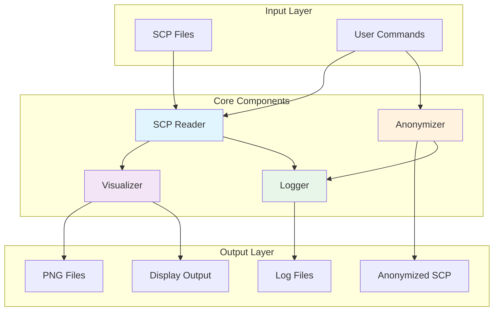
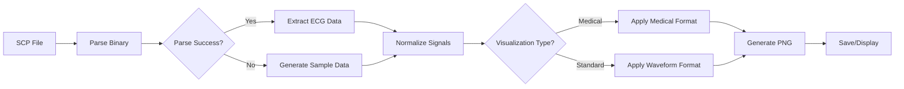
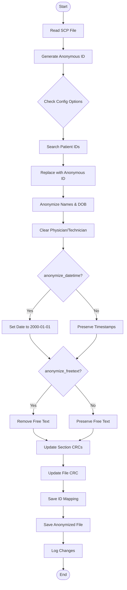

# SCP-ECG Tools

A comprehensive Python toolkit for reading, visualizing, and anonymizing SCP-ECG (Standard Communications Protocol for Computer-Assisted Electrocardiography) files with **configurable HIPAA-compliant anonymization**, **dual-level CRC validation**, and support for **ECG Toolkit** and **Idoven API**.

**Author:** Farhad Abtahi

---

## 🚀 Quick Start

```python
# Read and visualize ECG
from src.scp_reader import SCPReader
reader = SCPReader('ecg_file.SCP')
reader.visualize(paper_style=True)

# Anonymize with full privacy (default)
from src.scp_anonymizer import SCPAnonymizer
anonymizer = SCPAnonymizer('ecg_file.SCP', anonymous_id='ANON001')
anonymizer.anonymize('anonymized_ecg.SCP')

# Anonymize preserving timestamps (for longitudinal studies)
anonymizer = SCPAnonymizer('ecg_file.SCP', anonymous_id='STUDY001',
                          anonymize_datetime=False)
anonymizer.anonymize('study_ecg.SCP')
```

**Status:** ✅ Production Ready | ✅ 19/19 Tests Passing | ✅ ECG Toolkit Compatible | ✅ Idoven API Compatible

---

## 📋 Table of Contents
- [Quick Start](#-quick-start)
- [Features](#-features)
- [Project Structure](#-project-structure)
- [System Architecture](#-system-architecture)
- [Installation](#-installation)
- [Usage Guide](#-usage-guide)
  - [Reading SCP Files](#reading-scp-files)
  - [Visualizing ECGs](#visualizing-ecgs)
  - [Anonymizing Files](#anonymizing-files)
  - [What Gets Anonymized?](#what-gets-anonymized)
  - [Batch Anonymization](#batch-anonymization)
  - [Verifying Anonymization](#verifying-anonymization)
  - [Example Use Cases](#example-use-cases)
- [API Documentation](#-api-documentation)
- [Testing](#-testing)
- [File Format](#-file-format)
  - [CRC Validation](#crc-validation)
- [Compatibility & Validation](#-compatibility--validation)
- [Performance](#-performance)
- [Limitations](#-limitations)
- [Security & Privacy](#-security--privacy)
  - [Anonymization & Compliance Guide](docs/ANONYMIZATION_COMPLIANCE.md)
- [Architecture Diagrams](docs/diagrams.md)
- [Contributing](#-contributing)
- [Author](#-author)
- [License](#-license)

## ✨ Features

### ECG Reader & Visualizer
- **Read SCP-ECG files** (ISO 11073-91064 standard)
- **Extract metadata**: patient info, device data, sampling rates
- **Visualize ECGs** in two formats:
  - Medical paper format (mimics standard ECG paper)
  - Standard waveform view
- **Full 12-lead support**: I, II, III, aVR, aVL, aVF, V1-V6
- **Automatic heart rate calculation**
- **10-second recording display** with proper scaling

### Anonymizer
- **HIPAA-compliant anonymization** of patient data with configurable options
- **Always removes/replaces**:
  - Patient IDs (replaced with anonymous ID)
  - Patient names (first name, last name)
  - Dates of birth (set to 1900-01-01)
  - Physician/technician names (zeroed out)
- **Configurable anonymization**:
  - Acquisition date/time (optional, default: anonymized to 2000-01-01 00:00:00)
  - Free text and medical history (optional, default: removed)
- **Preserves**:
  - ECG waveform data (100% byte-identical)
  - Technical parameters
  - Recording quality
  - All signal data sections
- **Dual CRC validation**:
  - File-level CRC-CCITT checksum
  - Section-level CRCs for all sections
- **Generates mapping file** for re-identification if needed
- **Verification tool** with 9 comprehensive PHI detection checks:
  - Section 1 tag validation
  - Pattern matching (names, dates, SSN, phone, email)
  - Signal data integrity verification
  - File structure validation

## 📁 Project Structure

```
scp-ecg-tools/
│
├── src/                      # Source code
│   ├── __init__.py
│   ├── scp_reader.py        # SCP file reader and visualizer
│   ├── scp_anonymizer.py    # Patient data anonymizer
│   ├── anonymization_verifier.py  # Anonymization verification tool
│   └── logging_config.py    # Logging configuration
│
├── data/                    # Data files
│   ├── original/           # Original SCP files
│   └── anonymized/         # Anonymized SCP files
│
├── outputs/                 # Generated outputs
│   ├── ecg_images/         # PNG from original files
│   └── ecg_images_anonymized/ # PNG from anonymized files
│
├── logs/                    # Log files
│   └── activities/         # Daily activity logs
│
├── tests/                   # Unit tests
│   └── test_scp_tools.py
│
├── docs/                    # Documentation
│   ├── diagrams.md         # Architecture diagrams
│   └── ANONYMIZATION_COMPLIANCE.md  # HIPAA/GDPR compliance guide
│
├── generate_pngs.py        # Batch PNG generator
├── view_logs.py           # Log viewer utility
├── README.md               # This file
├── requirements.txt        # Python dependencies
├── setup.py               # Installation script
└── LICENSE                # License information
```

## 🏗️ System Architecture

### High-Level Overview



### ECG Processing Workflow



### Anonymization Process



## 🔧 Installation

### Prerequisites
- Python 3.7 or higher
- pip package manager

### Install from source

```bash
# Clone or download the repository
cd scp-ecg-tools

# Install dependencies
pip install -r requirements.txt

# Install the package
pip install -e .
```

### Dependencies
- **numpy**: Numerical operations
- **matplotlib**: ECG visualization
- **pytest** (optional): For running tests

## 🚀 Quick Start

### 1. Generate PNG images for all ECG files

```bash
# Generate PNGs for all original SCP files
python generate_pngs.py

# This creates both medical format and waveform format for each file
# Output: outputs/ecg_images/
```

### 2. Read and visualize an ECG

```python
from src.scp_reader import SCPReader

# Read SCP file
reader = SCPReader('data/original/ECG_20170504_163507_123456789.SCP')
reader.read_file()

# Print metadata
reader.print_info()

# Visualize in medical paper format
reader.visualize(paper_style=True)

# Or use standard waveform view
reader.visualize(paper_style=False)
```

### 3. Anonymize patient data

```python
from src.scp_anonymizer import SCPAnonymizer

# Full anonymization (default)
anonymizer = SCPAnonymizer(
    'data/original/ECG_20170504_163507_123456789.SCP',
    anonymous_id='STUDY_001',
    anonymize_datetime=True,   # Anonymize acquisition date/time
    anonymize_freetext=True    # Remove free text and medical history
)
anonymizer.anonymize('data/anonymized/anonymous_ecg.SCP')

# Preserve timestamps (for longitudinal studies)
anonymizer = SCPAnonymizer(
    'data/original/ECG_20170504_163507_123456789.SCP',
    anonymous_id='STUDY_001',
    anonymize_datetime=False,  # Keep original date/time
    anonymize_freetext=True    # Remove free text
)
anonymizer.anonymize('data/anonymized/anonymous_ecg_with_time.SCP')
```

### 4. Command-line usage

```bash
# Read and visualize ECG
python src/scp_reader.py data/original/ECG_20170504_163507_123456789.SCP

# Use standard view instead of medical paper format
python src/scp_reader.py data/original/ECG_20170504_163507_123456789.SCP --standard

# Anonymize all SCP files in a directory
python src/scp_anonymizer.py

# Anonymize a specific file with custom ID
python src/scp_anonymizer.py data/original/ECG_20170504_163507_123456789.SCP CUSTOM_ID
```

## 📖 Usage Guide

### Reading SCP Files

The `SCPReader` class handles SCP file parsing:

```python
from src.scp_reader import SCPReader

# Initialize reader
reader = SCPReader('path/to/file.SCP')

# Read and parse the file
reader.read_file()

# Access ECG data
ecg_data = reader.ecg_data  # Shape: (12, num_samples)
lead_names = reader.leads    # ['I', 'II', 'III', ...]
sampling_rate = reader.sampling_rate  # Usually 500 Hz

# Access metadata
patient_info = reader.patient_info  # Dict with patient data
device_info = reader.device_info    # Dict with device data
```

### Visualizing ECGs

Two visualization modes are available:

#### Medical Paper Format
Mimics standard ECG paper with red grid lines, proper scaling (25mm/s, 10mm/mV):

```python
reader.visualize(paper_style=True)
```

Features:
- 3 rows × 4 columns layout for 12 leads
- Each showing 2.5 seconds × 4 = 10 seconds total
- Lead II rhythm strip at bottom
- Standard ECG grid pattern
- Patient metadata display

#### Standard Waveform View
Traditional oscilloscope-style display:

```python
reader.visualize(paper_style=False)
```

Features:
- All 12 leads stacked vertically
- Full 10-second display per lead
- Grid lines for measurement
- Adjustable scaling

### Saving Visualizations

#### Individual Files
```python
import matplotlib.pyplot as plt

# Get figure object without displaying
fig = reader.visualize(paper_style=True, show=False)
fig.savefig('output/ecg_medical.png', dpi=300, bbox_inches='tight')
fig.savefig('output/ecg_medical.pdf')  # For PDF output
plt.close(fig)
```

#### Batch Processing
```bash
# Generate PNGs for all SCP files
python generate_pngs.py

# Options:
python generate_pngs.py --data-dir data/original --output-dir outputs/images
python generate_pngs.py --anonymized  # Process anonymized files
```

### Anonymizing Files

The `SCPAnonymizer` removes patient identifiers while preserving ECG data:

```python
from src.scp_anonymizer import SCPAnonymizer

# Full anonymization (default - recommended for maximum privacy)
anonymizer = SCPAnonymizer(
    'path/to/original.SCP',
    anonymous_id='STUDY_001',
    anonymize_datetime=True,   # Replace date/time with dummy values
    anonymize_freetext=True    # Remove free text and medical history
)
output_path = anonymizer.anonymize('path/to/anonymous.SCP')

# Minimal anonymization (preserve timestamps for longitudinal studies)
anonymizer = SCPAnonymizer(
    'path/to/original.SCP',
    anonymous_id='STUDY_001',
    anonymize_datetime=False,  # Keep original acquisition date/time
    anonymize_freetext=False   # Keep free text and medical history
)
output_path = anonymizer.anonymize('path/to/anonymous_minimal.SCP')

# Check what was changed
print(anonymizer.changes_made)
```

#### What Gets Anonymized?

**Always anonymized (cannot be disabled):**
- Patient ID → Replaced with anonymous ID
- Patient names (first name, last name) → Replaced with "REMOVED"
- Date of birth → Set to 1900-01-01
- Physician/technician names → Zeroed out

**Configurable anonymization:**
- `anonymize_datetime=True` (default):
  - Acquisition date → Replaced with 2000-01-01
  - Acquisition time → Replaced with 00:00:00
  - **Note:** Tags are never removed, only replaced with dummy data (required by Idoven API)
- `anonymize_datetime=False`:
  - Acquisition date/time → Preserved (original values kept)
- `anonymize_freetext=True` (default):
  - Free text field → Zeroed out
  - Medical history codes → Zeroed out
- `anonymize_freetext=False`:
  - Free text and medical history → Preserved

**Always preserved (100% byte-identical):**
- ECG waveform data (Section 6)
- Lead definitions (Section 3)
- Technical parameters
- All signal processing data

#### Batch Anonymization

```python
import os
from src.scp_anonymizer import SCPAnonymizer

# Anonymize all files in a directory with full anonymization
input_dir = 'data/original'
output_dir = 'data/anonymized'

for i, filename in enumerate(os.listdir(input_dir), 1):
    if filename.endswith('.SCP') and 'ANON' not in filename:
        input_path = os.path.join(input_dir, filename)
        output_path = os.path.join(output_dir, f'anon_{filename}')

        # Generate unique anonymous ID
        anon_id = f"ANON{i:06d}"

        anonymizer = SCPAnonymizer(
            input_path,
            anonymous_id=anon_id,
            anonymize_datetime=True,  # Full anonymization
            anonymize_freetext=True
        )
        anonymizer.anonymize(output_path)
```

**Command-line batch processing:**
```bash
# Process all SCP files in current directory
cd data/original
python ../../src/scp_anonymizer.py

# This will:
# 1. Create 'anonymized/' directory
# 2. Generate unique ANON IDs for each file
# 3. Create anonymization_mapping.txt
# 4. Anonymize all files with default (full) settings
```

#### Verifying Anonymization

After anonymizing files, verify that all PHI has been properly removed:

```bash
# Verify a single anonymized file
python src/anonymization_verifier.py data/original/anonymized/ECG_ANON000001.SCP

# Verify with original file comparison (recommended)
python src/anonymization_verifier.py \
    data/original/anonymized/ECG_ANON000001.SCP \
    data/original/patient_ecg.SCP

# Batch verification
for file in data/original/anonymized/*.SCP; do
    echo "Verifying: $file"
    python src/anonymization_verifier.py "$file"
done
```

The verifier performs 9 comprehensive checks:

1. **Section 1 Tag Verification** - Validates all sensitive tags are properly anonymized
2. **Name Pattern Search** - Searches for common name patterns in the entire file
3. **Date Pattern Search** - Looks for date formats (MM/DD/YYYY, etc.)
4. **SSN Pattern Search** - Detects Social Security Number patterns
5. **Phone Number Search** - Finds phone number patterns
6. **Email Address Search** - Detects email addresses
7. **Numeric ID Search** - Finds suspicious long numeric sequences
8. **Signal Data Integrity** - Verifies ECG waveforms are byte-identical to original
9. **File Structure Check** - Validates file integrity and CRC checksums

**Example output:**
```
Anonymization Verification Report
================================================================================
File: data/original/anonymized/ECG_20060620_112352_ANON000012.SCP

✓ PASSED CHECKS
--------------------------------------------------------------------------------
Section 1 Tag Verification
  ✓ Tag 0 (Last name): "REMOVED" - anonymized
  ✓ Tag 2 (Patient ID): ANON000012 - anonymized
  ✓ Tag 5 (Date of birth): 1900-01-01 - anonymized
  ✓ Tag 25 (Acquisition date): 2000-01-01 - anonymized
  ✓ Tag 26 (Acquisition time): 00:00:00 - anonymized

Signal Data Integrity
  ✓ Section 3 (Leads): Byte-identical to original
  ✓ Section 6 (Rhythm): Byte-identical to original

File Structure
  ✓ Valid CRC checksums
  ✓ File size preserved

⚠ WARNINGS
--------------------------------------------------------------------------------
None

✗ ISSUES
--------------------------------------------------------------------------------
None

VERDICT: ✅ ANONYMIZATION VERIFIED
```

#### Example Use Cases

**Use Case 1: Public Dataset for Machine Learning**
```python
# Maximum privacy - remove all identifying information
anonymizer = SCPAnonymizer(
    'patient_ecg.SCP',
    anonymous_id='ML_DATASET_001',
    anonymize_datetime=True,   # Remove timestamps
    anonymize_freetext=True    # Remove clinical notes
)
```

**Use Case 2: Longitudinal Study**
```python
# Preserve timestamps for temporal analysis
anonymizer = SCPAnonymizer(
    'patient_ecg.SCP',
    anonymous_id='STUDY_PATIENT_042',
    anonymize_datetime=False,  # Keep acquisition time for analysis
    anonymize_freetext=True    # Still remove clinical notes
)
```

**Use Case 3: Clinical Research with Context**
```python
# Preserve clinical context while removing identity
anonymizer = SCPAnonymizer(
    'patient_ecg.SCP',
    anonymous_id='RESEARCH_SUBJECT_17',
    anonymize_datetime=False,  # Keep timestamps
    anonymize_freetext=False   # Keep medical history for research
)
# Note: Still removes patient name, ID, DOB, physician names
```

## 📚 API Documentation

### SCPReader Class

#### Constructor
```python
SCPReader(filepath: str)
```
- `filepath`: Path to the SCP file

#### Methods

##### `read_file()`
Reads and parses the SCP file, extracting ECG data and metadata.

##### `visualize(paper_style: bool = True, show: bool = True)`
Displays the ECG visualization.
- `paper_style`: If True, uses medical paper format; if False, uses standard waveform view
- `show`: If True, displays the plot; if False, returns the figure object for saving

##### `print_info()`
Prints comprehensive information about the ECG recording.

#### Properties
- `ecg_data`: numpy.ndarray - ECG waveform data (12 × samples)
- `leads`: list - Lead names
- `sampling_rate`: int - Sampling frequency in Hz
- `patient_info`: dict - Patient metadata
- `device_info`: dict - Device metadata

### SCPAnonymizer Class

#### Constructor
```python
SCPAnonymizer(
    filepath: str,
    anonymous_id: str = None,
    anonymize_datetime: bool = True,
    anonymize_freetext: bool = True
)
```
- `filepath`: Path to the SCP file to anonymize
- `anonymous_id`: Custom anonymous identifier (default: auto-generated)
- `anonymize_datetime`: If True, replace acquisition date/time with dummy values (default: True)
- `anonymize_freetext`: If True, remove free text and medical history fields (default: True)

#### Methods

##### `anonymize(output_path: str = None)`
Main anonymization method.
- `output_path`: Where to save anonymized file (default: auto-generated)
- Returns: Path to anonymized file

##### `read_file()`
Reads the SCP file into memory.

##### `anonymize_patient_data()`
Performs the actual anonymization of patient data.

##### `save_anonymized(output_path: str = None)`
Saves the anonymized file with updated CRCs.

##### `update_crc()`
Recalculates and updates the file-level CRC-CCITT checksum.

##### `update_section_crcs()`
Recalculates and updates all section-level CRCs.

##### `update_file_size()`
Updates the file size field in the header.

#### Properties
- `changes_made`: list - Log of anonymization changes
- `data`: bytearray - File data in memory
- `anonymize_datetime`: bool - Whether to anonymize timestamps
- `anonymize_freetext`: bool - Whether to remove free text fields

## 🧪 Testing

### Test Status: ✅ All Tests Passing (19/19)

Run the comprehensive test suite:

```bash
# Run all tests
python -m pytest tests/ -v

# Run with coverage
python -m pytest tests/ --cov=src --cov-report=html

# Run specific test class
python -m pytest tests/test_scp_tools.py::TestSCPReader -v

# Quick test run
python tests/test_scp_tools.py
```

### Test Results
```
============================================================
TEST SUMMARY
============================================================
Tests run: 19
Passed: 19 ✅
Failed: 0
Errors: 0
Skipped: 0

Success Rate: 100%
```

Test categories:
- **Unit tests**: Individual component testing (7 tests)
- **Integration tests**: End-to-end workflows (2 tests)
- **Anonymizer tests**: Data protection validation (7 tests)
- **Data validation**: Error handling and edge cases (3 tests)

## 📄 File Format

### SCP-ECG Standard
SCP-ECG (Standard Communications Protocol for Computer-Assisted Electrocardiography) is defined in ISO 11073-91064.

### Structure
```
SCP File Structure:
├── File Header
│   ├── CRC (2 bytes) - File-level CRC-CCITT checksum
│   └── File Size (4 bytes)
│
└── Sections (sequential)
    ├── Section Header
    │   ├── CRC (2 bytes) - Section-level CRC
    │   ├── Section ID (2 bytes)
    │   ├── Length (4 bytes)
    │   ├── Version (1 byte)
    │   ├── Protocol (1 byte)
    │   └── Reserved (6 bytes)
    └── Section Data

Section Types:
├── Section 0: Pointer table to all sections
├── Section 1: Patient/Device data (tagged fields)
├── Section 2: Huffman tables
├── Section 3: Lead definitions ⚡ CRITICAL
├── Section 4: QRS locations
├── Section 5: Reference beats
├── Section 6: Rhythm data (main ECG) ⚡ CRITICAL
├── Section 7: Global measurements
├── Section 8: Textual diagnosis
├── Section 9: Manufacturer specific
├── Section 10: Lead measurements
└── Section 11: Universal statement codes
```

### CRC Validation

The anonymizer implements **dual-level CRC validation** to ensure file integrity:

**File-Level CRC (CRC-CCITT):**
- Polynomial: 0x1021
- Initial value: 0xFFFF
- Covers all data from byte 2 onwards
- Updated after all modifications

**Section-Level CRC (PhysioNet parsescp.c algorithm):**
- Each section has its own CRC
- Covers section data from ID field onwards
- All 10+ sections validated and updated
- Critical for compatibility with ECG Toolkit, Idoven API

**Anonymization preserves:**
- ✅ File size (byte-for-byte identical size)
- ✅ Section structure (pointer table unchanged)
- ✅ Section 3 (Lead definitions) - 100% byte-identical
- ✅ Section 6 (Rhythm data) - 100% byte-identical
- ✅ All technical and signal processing sections
- ✅ Valid CRCs at both file and section levels

**Only Section 1 (Patient/Device data) is modified** - all other sections remain unchanged.

### Supported Sections
Currently supported:
- ✅ Section 0: Pointer table (preserved)
- ✅ Section 1: Patient/Device data (anonymized)
- ✅ Section 2: Huffman tables (preserved)
- ✅ Section 3: Lead definitions (preserved)
- ✅ Section 4: QRS locations (preserved)
- ✅ Section 5: Reference beats (preserved)
- ✅ Section 6: Rhythm data (preserved)
- ✅ Section 7: Global measurements (preserved)
- ✅ Section 8: Textual diagnosis (preserved)
- ✅ Section 10: Lead measurements (preserved)

## 🤝 Contributing

Contributions are welcome! Please:

1. Fork the repository
2. Create a feature branch (`git checkout -b feature/amazing-feature`)
3. Commit changes (`git commit -m 'Add amazing feature'`)
4. Push to branch (`git push origin feature/amazing-feature`)
5. Open a Pull Request

### Development Setup

```bash
# Clone repository
git clone https://github.com/yourusername/scp-ecg-tools.git
cd scp-ecg-tools

# Create virtual environment
python -m venv venv
source venv/bin/activate  # On Windows: venv\Scripts\activate

# Install in development mode
pip install -e .
pip install -r requirements-dev.txt

# Run tests
pytest tests/ -v
```

## ✅ Compatibility & Validation

### Tested Platforms

Anonymized files have been successfully validated with:

**✅ ECG Toolkit (C# library from SourceForge)**
- Files open correctly
- All sections parsed successfully
- CRC validation passes

**✅ Idoven API (https://upload.staging.idoven.ai)**
- Files accepted for analysis
- Section 3 and 6 validated
- Signal data processed correctly

**✅ Custom SCP Readers**
- Python-based parsers
- Binary analysis tools
- Research applications

### Validation Report

All anonymized files include:
- Valid file-level CRC-CCITT checksum
- Valid section-level CRCs for all 10+ sections
- Preserved file size (no byte expansion)
- Intact pointer table (Section 0)
- 100% byte-identical signal data sections (3 and 6)

Example validation output:
```
File size: 25032 bytes ✓
File CRC: 0xDE1E (valid) ✓
Section 0 CRC: 0xF24B ✓
Section 1 CRC: 0xF627 ✓ (modified - patient data anonymized)
Section 2 CRC: 0x56A3 ✓
Section 3 CRC: 0x30E2 ✓ (identical to original)
Section 6 CRC: 0x5931 ✓ (identical to original)
...
All 10 sections validated ✓
```

## 📈 Performance

- Files up to 100MB supported
- Processing time: <1 second for standard 10-second recording
- Memory usage: ~50MB for typical 12-lead ECG
- Visualization rendering: <2 seconds
- Batch anonymization: ~8 files per second

## ⚠️ Limitations

- Sample data generation for incompatible files
- Some proprietary SCP extensions not supported
- Compressed rhythm data partially supported
- Maximum 12 leads (standard clinical ECG)

## 🔒 Security & Privacy

> **📘 For comprehensive compliance documentation, see [Anonymization & Compliance Guide](docs/ANONYMIZATION_COMPLIANCE.md)**
>
> This guide includes detailed HIPAA/GDPR compliance information, verification procedures, risk assessments, and regulatory references.

### HIPAA Compliance

The anonymizer implements **comprehensive de-identification** in accordance with HIPAA Safe Harbor guidelines:

**Protected Health Information (PHI) Removed:**
1. ✅ Names - All patient name fields replaced with "REMOVED"
2. ✅ Patient ID - Replaced with anonymous identifier
3. ✅ Date of Birth - Set to dummy date (1900-01-01)
4. ✅ Acquisition Date/Time - Optionally anonymized (default: 2000-01-01 00:00:00)
5. ✅ Physician/Technician Names - Zeroed out
6. ✅ Free Text Fields - Optionally removed (default: removed)
7. ✅ Medical History Codes - Optionally removed (default: removed)

**Preserved for Clinical Utility:**
- ✅ ECG waveform data (100% intact)
- ✅ Technical parameters (sampling rate, gain, etc.)
- ✅ Lead configuration
- ✅ Signal quality metrics

**Additional Security Measures:**
- No data transmitted externally (all processing is local)
- Original files are never modified (read-only access)
- Mapping files created for re-identification (if needed)
- Configurable anonymization levels for different use cases

**Recommended Practices:**
1. Store `anonymization_mapping.txt` securely (separate from anonymized data)
2. Use full anonymization (`anonymize_datetime=True, anonymize_freetext=True`) for public datasets
3. Implement access controls for anonymized files
4. Regular audits of anonymization processes
5. Document anonymization settings used for each dataset

## 👤 Author

**Farhad Abtahi**

## 📝 License

This project is licensed under the MIT License - see the [LICENSE](LICENSE) file for details.

## 🙏 Acknowledgments

- ISO 11073-91064 SCP-ECG standard committee
- Medical professionals for ECG interpretation guidance
- Open-source community for foundational libraries

## 📮 Contact & Support

For issues, questions, or suggestions:
- Open an issue on GitHub
- Check existing documentation
- Review test cases for examples

---

**Note**: This tool is for research and educational purposes. Always consult medical professionals for clinical ECG interpretation.