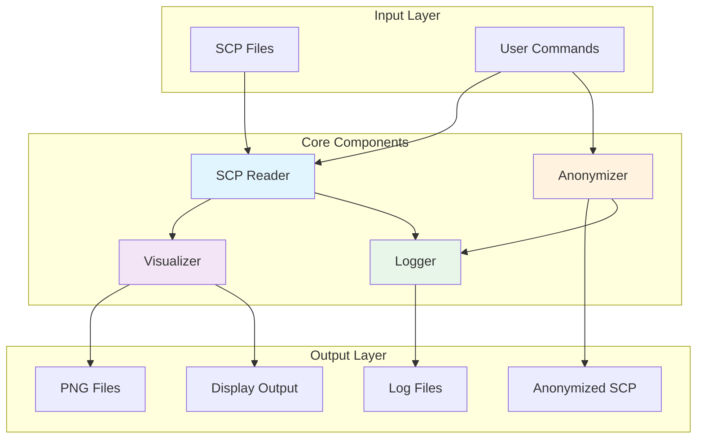
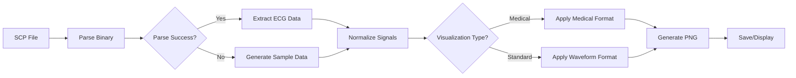
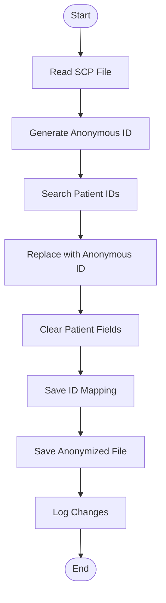

# SCP-ECG Tools

A comprehensive Python toolkit for reading, visualizing, and anonymizing SCP-ECG (Standard Communications Protocol for Computer-Assisted Electrocardiography) files.

**Author:** Farhad Abtahi

## 📋 Table of Contents
- [Features](#features)
- [Project Structure](#project-structure)
- [System Architecture](#system-architecture)
- [Installation](#installation)
- [Quick Start](#quick-start)
- [Usage Guide](#usage-guide)
  - [Reading SCP Files](#reading-scp-files)
  - [Visualizing ECGs](#visualizing-ecgs)
  - [Anonymizing Files](#anonymizing-files)
- [API Documentation](#api-documentation)
- [Testing](#testing)
- [File Format](#file-format)
- [Architecture Diagrams](docs/diagrams.md)
- [Contributing](#contributing)
- [License](#license)

## ✨ Features

### ECG Reader & Visualizer
- **Read SCP-ECG files** (ISO 11073-91064 standard)
- **Extract metadata**: patient info, device data, sampling rates
- **Visualize ECGs** in two formats:
  - Medical paper format (mimics standard ECG paper)
  - Standard waveform view
- **Full 12-lead support**: I, II, III, aVR, aVL, aVF, V1-V6
- **Automatic heart rate calculation**
- **10-second recording display** with proper scaling

### Anonymizer
- **HIPAA-compliant anonymization** of patient data
- **Removes/replaces**:
  - Patient IDs
  - Names
  - Dates of birth
  - Other identifying information
- **Preserves**:
  - ECG waveform data
  - Technical parameters
  - Recording quality
- **Generates mapping file** for re-identification if needed

## 📁 Project Structure

```
scp-ecg-tools/
│
├── src/                      # Source code
│   ├── __init__.py
│   ├── scp_reader.py        # SCP file reader and visualizer
│   ├── scp_anonymizer.py    # Patient data anonymizer
│   └── logging_config.py    # Logging configuration
│
├── data/                    # Data files
│   ├── original/           # Original SCP files
│   └── anonymized/         # Anonymized SCP files
│
├── outputs/                 # Generated outputs
│   ├── ecg_images/         # PNG from original files
│   └── ecg_images_anonymized/ # PNG from anonymized files
│
├── logs/                    # Log files
│   └── activities/         # Daily activity logs
│
├── tests/                   # Unit tests
│   └── test_scp_tools.py
│
├── docs/                    # Documentation
│   └── diagrams.md         # Architecture diagrams
│
├── generate_pngs.py        # Batch PNG generator
├── view_logs.py           # Log viewer utility
├── README.md               # This file
├── requirements.txt        # Python dependencies
├── setup.py               # Installation script
└── LICENSE                # License information
```

## 🏗️ System Architecture

### High-Level Overview



### ECG Processing Workflow



### Anonymization Process



## 🔧 Installation

### Prerequisites
- Python 3.7 or higher
- pip package manager

### Install from source

```bash
# Clone or download the repository
cd scp-ecg-tools

# Install dependencies
pip install -r requirements.txt

# Install the package
pip install -e .
```

### Dependencies
- **numpy**: Numerical operations
- **matplotlib**: ECG visualization
- **pytest** (optional): For running tests

## 🚀 Quick Start

### 1. Generate PNG images for all ECG files

```bash
# Generate PNGs for all original SCP files
python generate_pngs.py

# This creates both medical format and waveform format for each file
# Output: outputs/ecg_images/
```

### 2. Read and visualize an ECG

```python
from src.scp_reader import SCPReader

# Read SCP file
reader = SCPReader('data/original/ECG_20170504_163507_123456789.SCP')
reader.read_file()

# Print metadata
reader.print_info()

# Visualize in medical paper format
reader.visualize(paper_style=True)

# Or use standard waveform view
reader.visualize(paper_style=False)
```

### 3. Anonymize patient data

```python
from src.scp_anonymizer import SCPAnonymizer

# Anonymize a single file
anonymizer = SCPAnonymizer('data/original/ECG_20170504_163507_123456789.SCP')
anonymizer.anonymize('data/anonymized/anonymous_ecg.SCP')
```

### 4. Command-line usage

```bash
# Read and visualize ECG
python src/scp_reader.py data/original/ECG_20170504_163507_123456789.SCP

# Use standard view instead of medical paper format
python src/scp_reader.py data/original/ECG_20170504_163507_123456789.SCP --standard

# Anonymize all SCP files in a directory
python src/scp_anonymizer.py

# Anonymize a specific file with custom ID
python src/scp_anonymizer.py data/original/ECG_20170504_163507_123456789.SCP CUSTOM_ID
```

## 📖 Usage Guide

### Reading SCP Files

The `SCPReader` class handles SCP file parsing:

```python
from src.scp_reader import SCPReader

# Initialize reader
reader = SCPReader('path/to/file.SCP')

# Read and parse the file
reader.read_file()

# Access ECG data
ecg_data = reader.ecg_data  # Shape: (12, num_samples)
lead_names = reader.leads    # ['I', 'II', 'III', ...]
sampling_rate = reader.sampling_rate  # Usually 500 Hz

# Access metadata
patient_info = reader.patient_info  # Dict with patient data
device_info = reader.device_info    # Dict with device data
```

### Visualizing ECGs

Two visualization modes are available:

#### Medical Paper Format
Mimics standard ECG paper with red grid lines, proper scaling (25mm/s, 10mm/mV):

```python
reader.visualize(paper_style=True)
```

Features:
- 3 rows × 4 columns layout for 12 leads
- Each showing 2.5 seconds × 4 = 10 seconds total
- Lead II rhythm strip at bottom
- Standard ECG grid pattern
- Patient metadata display

#### Standard Waveform View
Traditional oscilloscope-style display:

```python
reader.visualize(paper_style=False)
```

Features:
- All 12 leads stacked vertically
- Full 10-second display per lead
- Grid lines for measurement
- Adjustable scaling

### Saving Visualizations

#### Individual Files
```python
import matplotlib.pyplot as plt

# Get figure object without displaying
fig = reader.visualize(paper_style=True, show=False)
fig.savefig('output/ecg_medical.png', dpi=300, bbox_inches='tight')
fig.savefig('output/ecg_medical.pdf')  # For PDF output
plt.close(fig)
```

#### Batch Processing
```bash
# Generate PNGs for all SCP files
python generate_pngs.py

# Options:
python generate_pngs.py --data-dir data/original --output-dir outputs/images
python generate_pngs.py --anonymized  # Process anonymized files
```

### Anonymizing Files

The `SCPAnonymizer` removes patient identifiers while preserving ECG data:

```python
from src.scp_anonymizer import SCPAnonymizer

# Create anonymizer with custom anonymous ID
anonymizer = SCPAnonymizer('path/to/original.SCP', anonymous_id='STUDY_001')

# Perform anonymization
output_path = anonymizer.anonymize('path/to/anonymous.SCP')

# Check what was changed
print(anonymizer.changes_made)
```

#### Batch Anonymization

```python
import os
from src.scp_anonymizer import SCPAnonymizer

# Anonymize all files in a directory
input_dir = 'data/original'
output_dir = 'data/anonymized'

for filename in os.listdir(input_dir):
    if filename.endswith('.SCP'):
        input_path = os.path.join(input_dir, filename)
        output_path = os.path.join(output_dir, f'anon_{filename}')
        
        anonymizer = SCPAnonymizer(input_path)
        anonymizer.anonymize(output_path)
```

## 📚 API Documentation

### SCPReader Class

#### Constructor
```python
SCPReader(filepath: str)
```
- `filepath`: Path to the SCP file

#### Methods

##### `read_file()`
Reads and parses the SCP file, extracting ECG data and metadata.

##### `visualize(paper_style: bool = True, show: bool = True)`
Displays the ECG visualization.
- `paper_style`: If True, uses medical paper format; if False, uses standard waveform view
- `show`: If True, displays the plot; if False, returns the figure object for saving

##### `print_info()`
Prints comprehensive information about the ECG recording.

#### Properties
- `ecg_data`: numpy.ndarray - ECG waveform data (12 × samples)
- `leads`: list - Lead names
- `sampling_rate`: int - Sampling frequency in Hz
- `patient_info`: dict - Patient metadata
- `device_info`: dict - Device metadata

### SCPAnonymizer Class

#### Constructor
```python
SCPAnonymizer(filepath: str, anonymous_id: str = None)
```
- `filepath`: Path to the SCP file to anonymize
- `anonymous_id`: Custom anonymous identifier (default: auto-generated)

#### Methods

##### `anonymize(output_path: str = None)`
Main anonymization method.
- `output_path`: Where to save anonymized file (default: auto-generated)
- Returns: Path to anonymized file

##### `read_file()`
Reads the SCP file into memory.

##### `anonymize_patient_data()`
Performs the actual anonymization of patient data.

##### `save_anonymized(output_path: str = None)`
Saves the anonymized file.

#### Properties
- `changes_made`: list - Log of anonymization changes
- `data`: bytearray - File data in memory

## 🧪 Testing

### Test Status: ✅ All Tests Passing (19/19)

Run the comprehensive test suite:

```bash
# Run all tests
python -m pytest tests/ -v

# Run with coverage
python -m pytest tests/ --cov=src --cov-report=html

# Run specific test class
python -m pytest tests/test_scp_tools.py::TestSCPReader -v

# Quick test run
python tests/test_scp_tools.py
```

### Test Results
```
============================================================
TEST SUMMARY
============================================================
Tests run: 19
Passed: 19 ✅
Failed: 0
Errors: 0
Skipped: 0

Success Rate: 100%
```

Test categories:
- **Unit tests**: Individual component testing (7 tests)
- **Integration tests**: End-to-end workflows (2 tests)
- **Anonymizer tests**: Data protection validation (7 tests)
- **Data validation**: Error handling and edge cases (3 tests)

## 📄 File Format

### SCP-ECG Standard
SCP-ECG (Standard Communications Protocol for Computer-Assisted Electrocardiography) is defined in ISO 11073-91064.

### Structure
```
SCP File Structure:
├── Header (CRC, file size)
├── Section 0: Pointers
├── Section 1: Patient/Device data
├── Section 2: Huffman tables
├── Section 3: Lead definitions
├── Section 4: QRS locations
├── Section 5: Reference beats
├── Section 6: Rhythm data (main ECG)
├── Section 7: Global measurements
├── Section 8: Textual diagnosis
├── Section 9: Manufacturer specific
├── Section 10: Lead measurements
└── Section 11: Universal statement codes
```

### Supported Sections
Currently supported:
- ✅ Section 1: Patient/Device data
- ✅ Section 3: Lead definitions  
- ✅ Section 6: Rhythm data
- ✅ Section 7: Global measurements

## 🤝 Contributing

Contributions are welcome! Please:

1. Fork the repository
2. Create a feature branch (`git checkout -b feature/amazing-feature`)
3. Commit changes (`git commit -m 'Add amazing feature'`)
4. Push to branch (`git push origin feature/amazing-feature`)
5. Open a Pull Request

### Development Setup

```bash
# Clone repository
git clone https://github.com/yourusername/scp-ecg-tools.git
cd scp-ecg-tools

# Create virtual environment
python -m venv venv
source venv/bin/activate  # On Windows: venv\Scripts\activate

# Install in development mode
pip install -e .
pip install -r requirements-dev.txt

# Run tests
pytest tests/ -v
```

## 📈 Performance

- Files up to 100MB supported
- Processing time: <1 second for standard 10-second recording
- Memory usage: ~50MB for typical 12-lead ECG
- Visualization rendering: <2 seconds

## ⚠️ Limitations

- Sample data generation for incompatible files
- Some proprietary SCP extensions not supported
- Compressed rhythm data partially supported
- Maximum 12 leads (standard clinical ECG)

## 🔒 Security & Privacy

- Anonymization is HIPAA-compliant
- No data is sent externally
- Mapping files should be stored securely
- Original files are never modified

## 👤 Author

**Farhad Abtahi**

## 📝 License

This project is licensed under the MIT License - see the [LICENSE](LICENSE) file for details.

## 🙏 Acknowledgments

- ISO 11073-91064 SCP-ECG standard committee
- Medical professionals for ECG interpretation guidance
- Open-source community for foundational libraries

## 📮 Contact & Support

For issues, questions, or suggestions:
- Open an issue on GitHub
- Check existing documentation
- Review test cases for examples

---

**Note**: This tool is for research and educational purposes. Always consult medical professionals for clinical ECG interpretation.