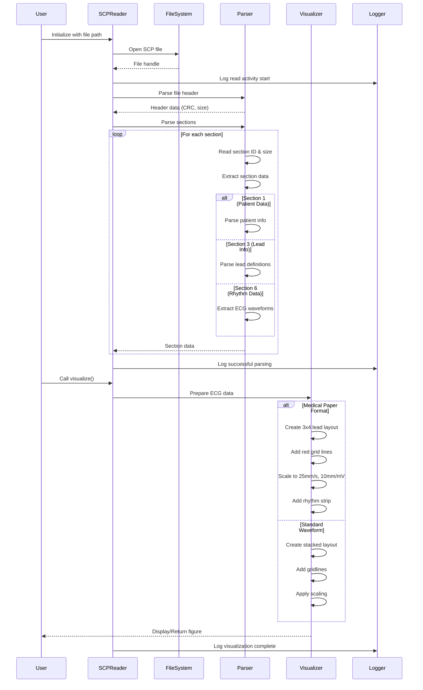
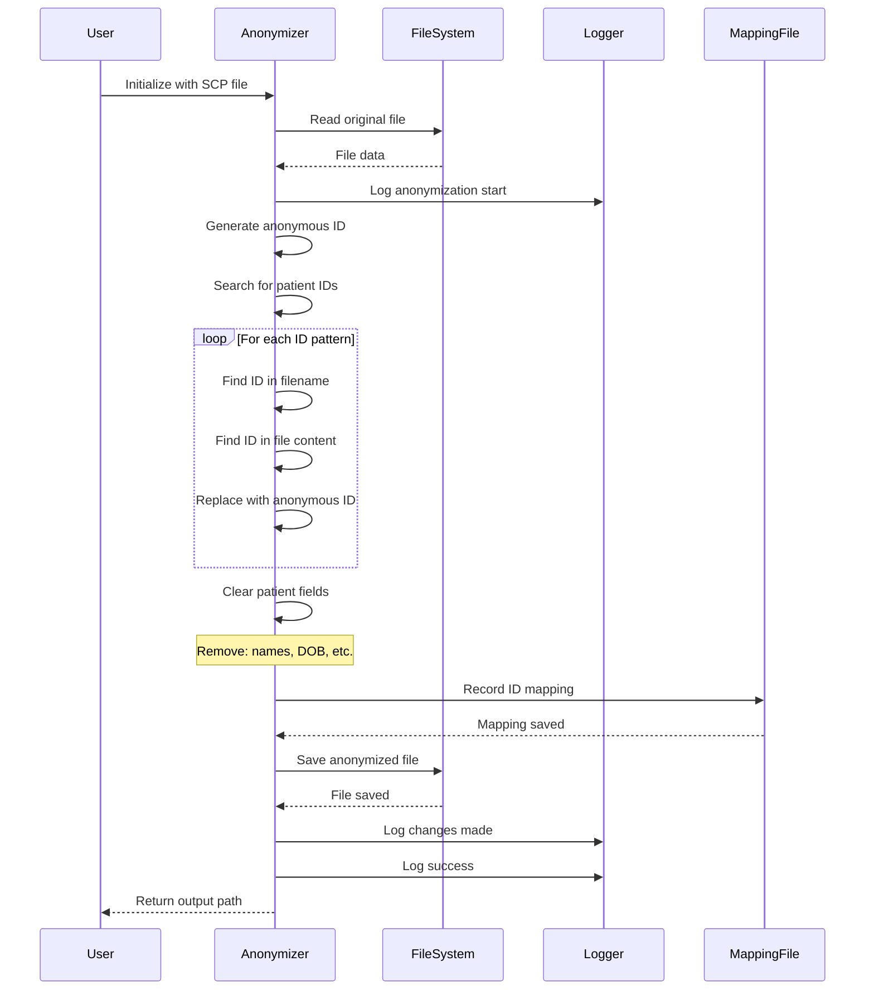
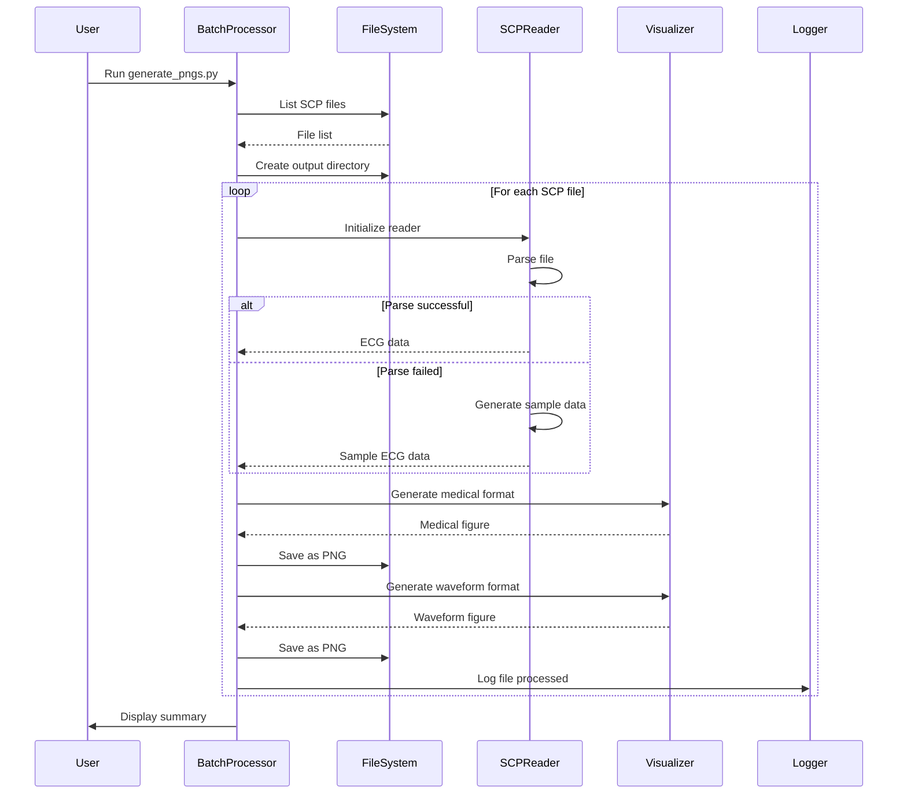
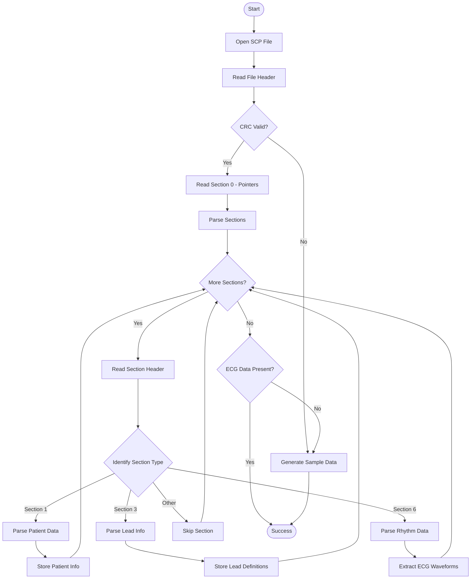
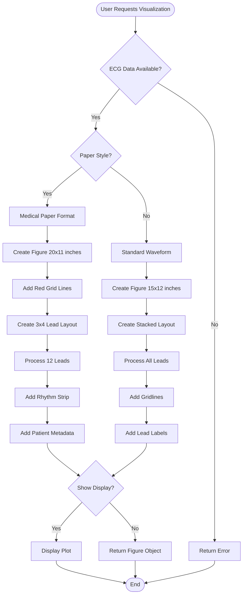
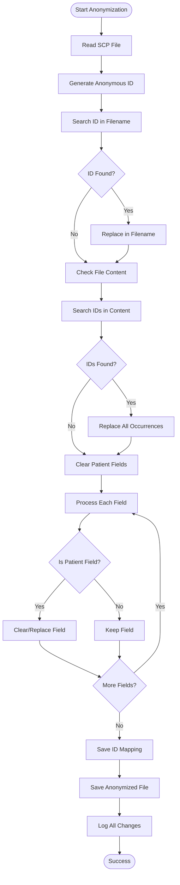
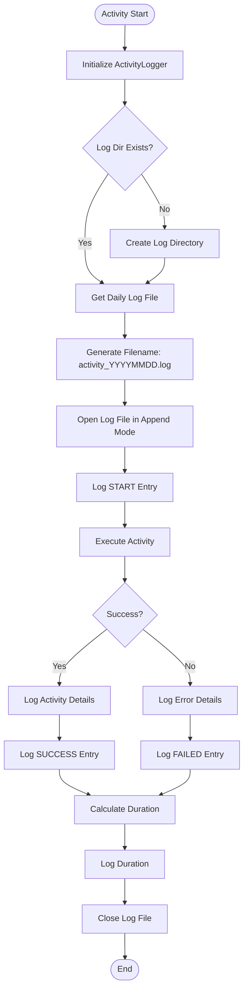
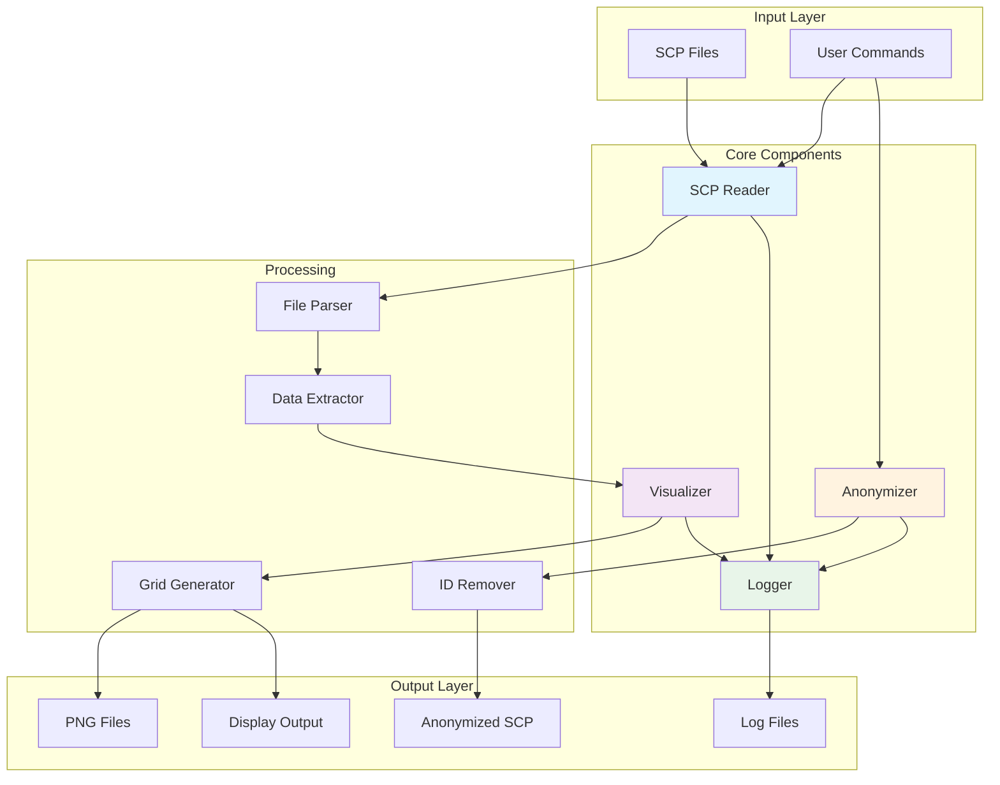
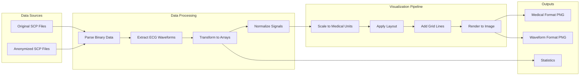
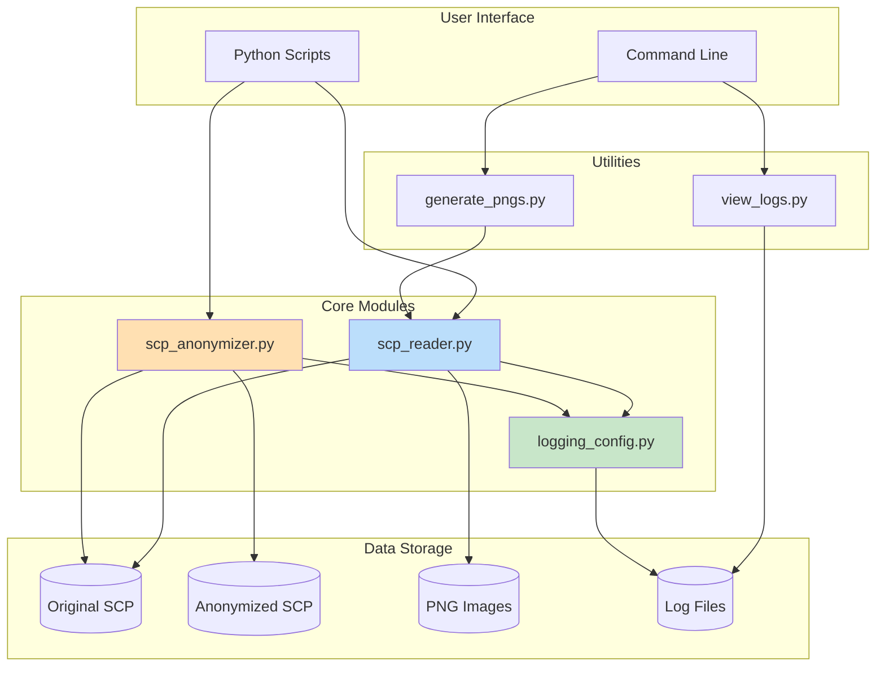

# System Architecture Diagrams

**Author:** Farhad Abtahi

## 1. Sequence Diagrams

### 1.1 ECG Reading and Visualization Workflow

### 1.2 Anonymization Workflow

### 1.3 Batch PNG Generation Workflow

## 2. Flowcharts

### 2.1 SCP File Parsing Process

### 2.2 Visualization Decision Flow

### 2.3 Anonymization Process Flow

### 2.4 Logging System Flow

## 3. System Architecture Overview

## 4. Data Flow Diagram

## 5. Component Interaction Diagram

